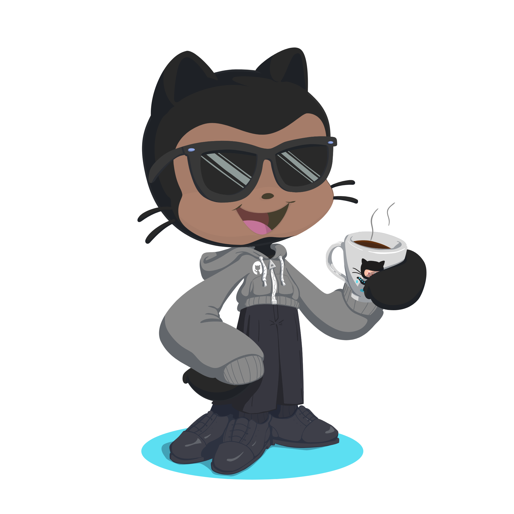

<h1 align="center">Hey 👋 What's Up? I'm Carlos</h1>

  

<!-- OCTOCAT DE OCTODEX Y GIF ANIMADO PRINCIPAL -->

  
  &nbsp;&nbsp;&nbsp;&nbsp;
  

<!-- SECCIÓN DE TECNOLOGÍAS ANIMADAS (MÁS GRANDES Y TUS LINKS EXACTOS) -->
<h3 align="center">🛠️ Tech Stack & Tools (Animated)</h3>

<!-- LENGUAJES Y HERRAMIENTAS CON GIFS -->

  
  
  
  
  
  
  
  

<!-- FRAMEWORKS & ECOSYSTEM -->

  
  
  
  
  
  
  
  

 

<!-- REDES SOCIALES -->

  
  

 

<!-- ESTADÍSTICAS EN LÍNEA -->
<h3 align="center">📊 GitHub Metrics</h3>

  
  &nbsp;&nbsp;
  

 

<!-- ANIMACIONES PACMAN Y SNAKE -->
<h3 align="center">👾 Contribution Activities</h3>

  <picture>
    <source media="(prefers-color-scheme: dark)" srcset="https://raw.githubusercontent.com/Carlitops13/Carlitops13/output/pacman-contribution-graph-dark.svg">
    <source media="(prefers-color-scheme: light)" srcset="https://raw.githubusercontent.com/Carlitops13/Carlitops13/output/pacman-contribution-graph.svg">
    
  </picture>

